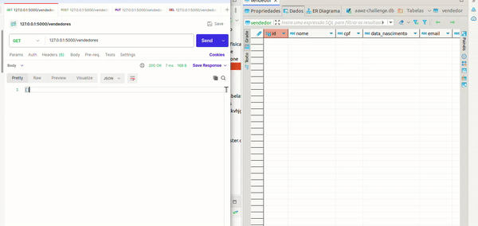
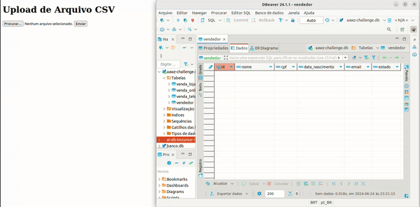
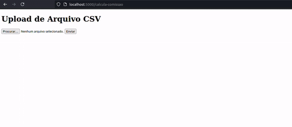
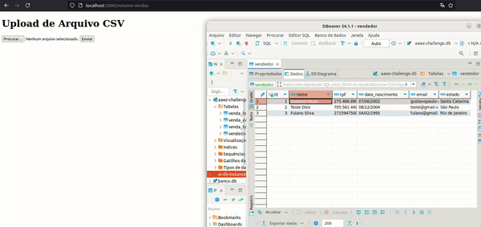

# AAWZ Challenge Backend
Desafio técnico AAWZ - Backend

Esse README contêm respectivamente, os seguintes tópicos:
- [Ambiente Virtual](#ambiente-virtual-opcional-mas-recomendado)
- [Instalação de dependências](#instalar-dependências)
- [Subindo a aplicação](#subindo-a-aplicação)
- [Testando exercício por exercício](#testando-exercício-por-exercício)

## Ambiente Virtual (Opcional, mas Recomendado)

Para isolar as dependências instaladas, é recomendado o uso de um ambiente virtual. Siga os passos abaixo para criar e ativar a venv:

### Linux e macOS

1. Abra o terminal.
2. Navegue até o diretório do projeto:

```bash
cd aawz_challenge
```

3. Crie um ambiente virtual:
```bash
python3 -m venv venv
```

4. Ative o ambiente virtual:
```bash
source venv/bin/activate
```

### Windows

1. Abra o prompt de comando
2. Navegue até o diretório do projeto:
```bash
cd aawz_challenge
```

3. Crie um ambiente virtual:
```bash
python3 -m venv venv
```

4. Ative o ambiente virtual:
```bash
venv\Scripts\activate
```

## Instalar Dependências
Para instalar as dependências, utilize o seguinte comando:
```bash
pip install -r requirements.txt
```

## Subindo a aplicação

Para subir o backend, utilize o seguinte comando:
```bash
python3 app.py
```

# Testando exercício por exercício

## N° 1
A rota correspondente ao exercício n°1 é /vendedores.
É possível realizar requisições HTTP para essa rota pra fazer o CRUD, através das requisições GET, POST, PUT, DELETE. A seguir testarei as quatro requisições utilizando Postman.

<p align="center">
  
</p>

## N° 2
A rota correspondente ao desafio n°2 é /importar-vendedores, eu implementei um html básico pra conseguir enviar um arquivo .CSV na requisição HTTP e conseguir testar mais facilmente essa tarefa. Exemplo de arquivo a ser utilizado [aqui](https://docs.google.com/spreadsheets/d/1dK91Yw69Wka9oA15Mw8zhz5GX3upiZihDyG14iZTAPg/edit?usp=sharing). Para testar basta entrar na url, carregar o arquivo csv e enviar. Pronto, agora basta olhar o banco de dados e conferir :) A seguir tem um exemplo de teste do funcionamento.

<p align="center">
  
</p>


## N° 3
A rota correspondente ao desafio n³3 é /calcula-comissao, eu implementei um html básico idêntico aos anteriores pra conseguir enviar um arquivo.CSV na requisição HTTP e conseguir testar mais facilmente essa tarefa. Exemplo de arquivo a ser utilizado é o disponibilizado no enunciado do desafio, em formato .CSV. Nesse aqui eu usei a mesma solução que tinha usado no outro teste técnico, só coloquei dentro do endpoint flask e ajustei o único detalhe que mudou que era trocar um R$ 1500 por R$ 1000. Essa aqui pra variar eu não coloquei o output_data no db, coloquei no local, é possível testar assim como no exemplo a seguir:

<p align="center">
  
</p>


## N° 4
No banco de dados tem 1 tabela pra vendas físicas, 1 pra vendas online e 1 pra vendas telefone. Fiz o mesmo esquema do html pra enviar .csv na rota /volume-vendas e aí os vendedores que venderam por telefone tem suas vendas cadastradas na tabela do telefone, mesma coisa com os demais. Um exemplo do funcionamento pode ser visto no gif a seguir.

<p align="center">
  
</p>


### Observações finais

Todos os desafios foram cumpridos com êxito, inclusive os bonus (flask e integração com sqlite). Fico a disposição pra qualquer eventual dúvida.